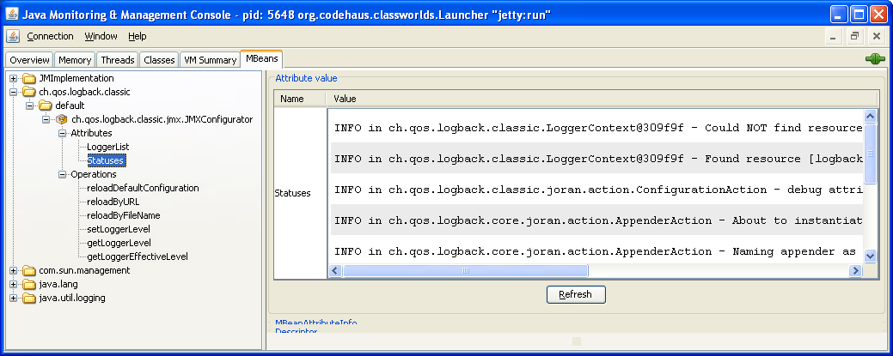

顾名思义，`JMXConfigurator` 允许通过 JMX 来配置 logback。简单来说就是，它允许你从默认配置文件，指定的文件或者 URL 重新配置 logback，列出 logger 以及修改 logger 级别。

### 使用 JMX 配置器

如果你的运行在 JDK 1.6 或者更高的版本，那么你仅仅需要在命令行调用 `jconsole`，然后连接到你服务器上的 MBeanServer。如果你运行在老版本的 JVM 上，那么你需要查看[在服务上使用 JMX](https://logback.qos.ch/manual/jmxConfig.html#jmxEnablingServer)。

在配置文件中开启 `JMXConfigurator` 只需要一行。如下：

```xml
<configuration>
  <jmxConfigurator />
  
  <appender name="console" class="ch.qos.logback.core.ConsoleAppender">
    <layout class="ch.qos.logback.classic.PatternLayout">
      <Pattern>%date [%thread] %-5level %logger{25} - %msg%n</Pattern>
    </layout>
  </appender>

  <root level="debug">
    <appender-ref ref="console" />
  </root>  
</configuration>
```

在你通过 *jconsole* 连接到服务器上之后，在 MBeans 面板上，在 "ch.qos.logback.classic.jmx.Configurator" 文件夹下你可以看到几个选项。如下图所示：

### 在 `jconsole` 中查看 `JMXConfigurator` 的截图


所以，你可以

-   使用默认配置文件重新加载 logback 的配置
-   通过指定的 URL 重新加载配置
-   通过指定的文件重新加载配置
-   设置指定的 logger 的级别。想要设置为 null，传递 "null" 字符串就可以
-   获取指定 logger 的级别。返回值可以为 null
-   或者指定 logger 的[有效级别](https://github.com/Volong/logback-chinese-manual/blob/master/02%E7%AC%AC%E4%BA%8C%E7%AB%A0%EF%BC%9A%E6%9E%B6%E6%9E%84.md#%E6%9C%89%E6%95%88%E7%AD%89%E7%BA%A7%E5%8F%88%E7%A7%B0%E4%B8%BA%E7%AD%89%E7%BA%A7%E7%BB%A7%E6%89%BF)

`JMXConfigurator` 将已经存在的 logger 以及状态当作属性进行展示。

这个状态列表可以帮助你诊断 logger 的内部状态。



### 避免内存泄漏

如果你的应用部署在 web 服务器或者应用服务器上，注册的 `JMXConfigurator` 实例会从系统类加载器创建一个引用到你的应用中。在应用停止或者重新部署事，它会阻止垃圾回收，那么将会导致内存泄漏。

因此，除非你的应用是单机的 Java 应用，否则的话，你必须从 JVM 的 Mbeans 服务上注销 `JMXConfigurator` 实例。通过 `LoggerContext` 调用 `reset()` 方法将会自动注销任何 JMXConfigurator 实例。一个好的方法去重置 logger 上下文是通过 `javax.servlet.ServletContextListener` 中的 `contextDestroyed()` 方法。示例代码如下：

```java
import javax.servlet.ServletContextEvent;
import javax.servlet.ServletContextListener;

import org.slf4j.LoggerFactory;
import ch.qos.logback.classic.LoggerContext;

public class MyContextListener implements ServletContextListener {

  public void contextDestroyed(ServletContextEvent sce) {
    LoggerContext lc = (LoggerContext) LoggerFactory.getILoggerFactory();
    lc.stop();
  }

  public void contextInitialized(ServletContextEvent sce) {
  }
} 
```

## `JMXConfigurator` 与多个 web 应用

如果你在同一个服务器上部署了多个 web 应用，并且你没有重写默认的[上下文选择器](https://github.com/Volong/logback-chinese-manual/blob/master/09%E7%AC%AC%E4%B9%9D%E7%AB%A0%EF%BC%9A%E6%97%A5%E5%BF%97%E9%9A%94%E7%A6%BB.md#%E4%B8%8A%E4%B8%8B%E6%96%87%E9%80%89%E6%8B%A9%E5%99%A8)，以及你把 *logback-\*.jar* 与 *slf4j-api.jar* 放到了每个 web 应用的 *WEB-INF/lib* 文件夹下。